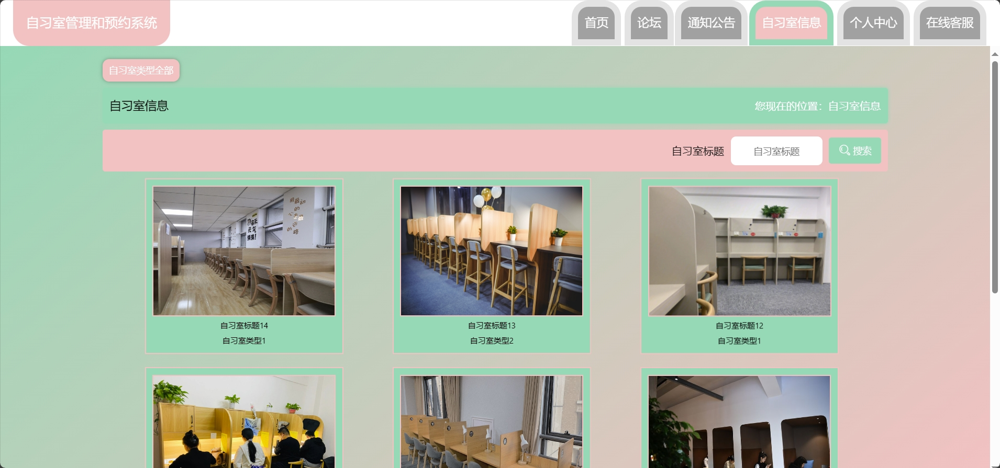
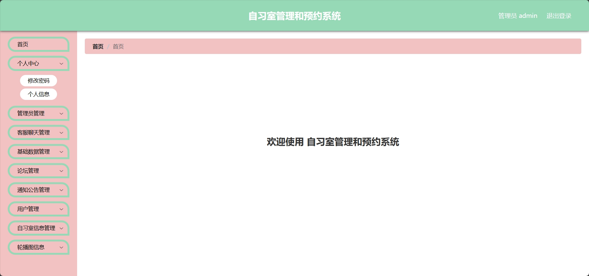
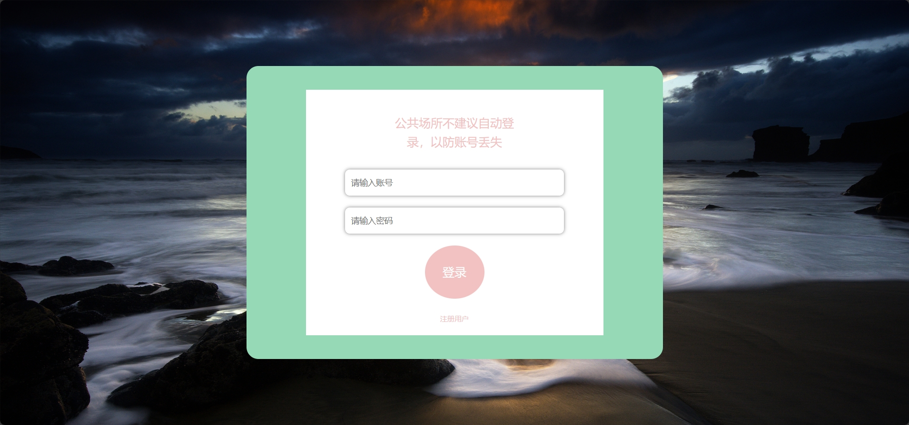
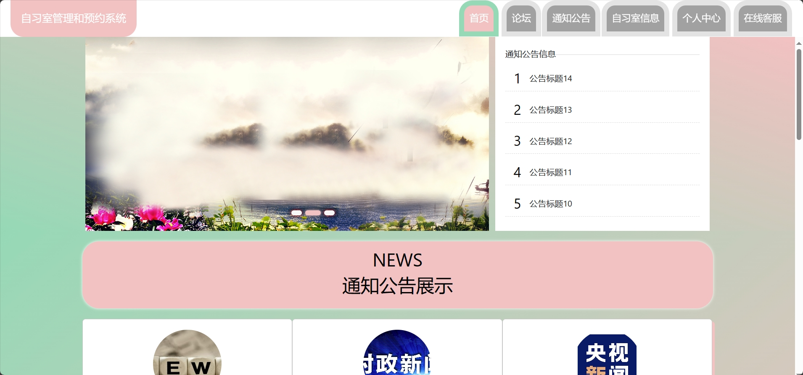
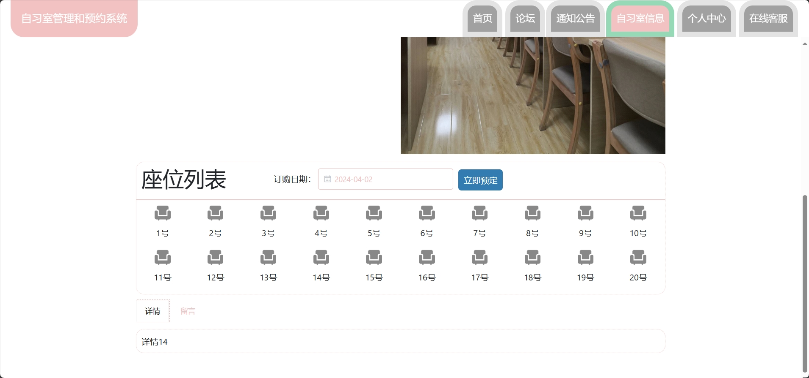
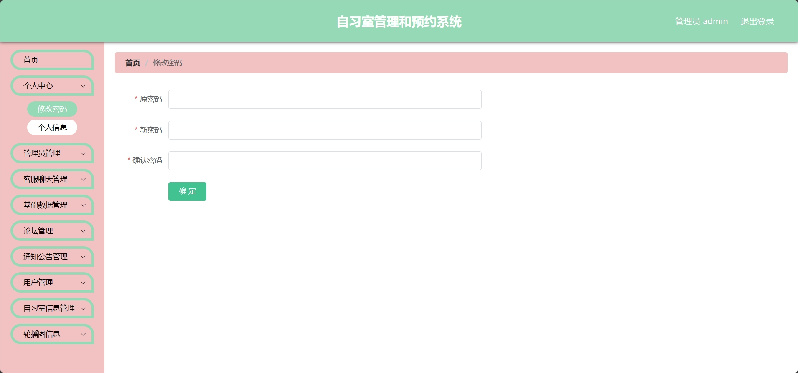

<h1 align="center">基于SSM框架的自习室预约管理系统</h1>

 获取sql文件 QQ: 605739993 QQ群: 377586148 

 [个人站点: 从戎源码网](https://armycodes.com/)

## 简介

> 本代码来源于网络,仅供学习参考使用!
>
> 提供1.远程部署/2.修改代码/3.设计文档指导/4.框架代码讲解等服务
>
> 管理端地址：http://localhost:8081/
>
> 管理员: admin 密码: 123456
> 
> 用户端地址：http://localhost:8081/zxsguanliyuyue/front/pages/login/login.html
>
> 用户：zhangsan 密码: 123456
>

## 项目介绍

基于SSM框架的自习室预约管理系统：前端 Vue、ElementUI，后端 maven、springmvc、mybatis；角色分为管理员和用户。管理员发布新闻公告、添加演唱会类型、发布演唱会以及票务数量等；用户按演唱会类别买票、支付、添加购物车等。主要功能如下：

### 启动方式

- 前端：
> 打开终端 | cd src/main/resources/admin/admin
>
> npm install
> 
> npm run serve

- 后端：
> 按钮启动 | 右键run zxsguanliyuyueApplication

### 管理员：

- 基本操作：登录、修改密码、注册、获取个人信息
- 管理员管理：获取管理员列表、修改管理员信息、删除管理员、新增管理员、筛选管理员信息
- 客服聊天管理：获取回复列表、回复
- 基础数据管理：获取公告类型列表、筛选公告类型、查看公告类型详情、修改公告类型内容、删除公告类型信息、新增公告类型、获取自习室类型列表、筛选自习室类型、查看自习室类型详情、修改自习室类型内容、删除自习室类型信息、新增自习室类型
- 论坛管理：获取论坛列表、查看论坛详情、回复论坛评论、查看论坛评论、删除论坛帖子、修改论坛内容、筛选论坛信息、新增论坛信息
- 通知公告管理：获取公告列表、查看公告详情、删除公告信息、修改公告内容、筛选公告信息、新增公告信息
- 用户管理：获取用户列表、查看用户详情、修改用户内容、删除用户信息、修改用户信息、重置密码、筛选用户信息、新增用户信息
- 自习室信息管理：获取自习室列表、新增自习室、删除自习室信息、筛选自习室信息、查看自习室信息详情、修改自习室信息
- 自习室留言管理：获取自习室留言列表、删除自习室留言信息、筛选自习室留言信息、查看自习室信息留言详情、回复留言
- 自习室收藏管理：获取自习室收藏列表、删除自习室收藏信息、筛选自习室收藏信息、查看自习室信息收藏详情
- 订单管理：获取订单列表、删除订单信息、筛选订单信息、查看订单详情、获取报表
- 轮播图管理：获取轮播图列表、删除轮播图信息、筛选轮播图信息、查看轮播图详情、修改轮播图信息、新增轮播图信息

### 用户：

- 基本操作：登录、注册、修改密码、获取个人信息、修改个人信息、在线客服
- 公告模块：获取公告列表、查看公告详情、筛选公告信息
- 论坛模块：获取论坛列表、查看论坛详情、发布论坛信息、评论、回复、筛选论坛信息
- 自习室模块：筛选自习室、获取自习室列表、查看自习室详情、选座、收藏自习室、点赞自习室、拉踩自习室、留言、预订
- 个人中心：获取收藏自习室列表、取消收藏、自习室评论回复、获取订单列表、取消订单、完成订单

## 环境

- <b>IntelliJ IDEA 2020.3</b>

- <b>Mysql 5.7.26</b>

- <b>NodeJs 14.17.3</b>

- <b>Maven 3.6.3</b>

- <b>JDK 1.8</b>

## 运行截图

